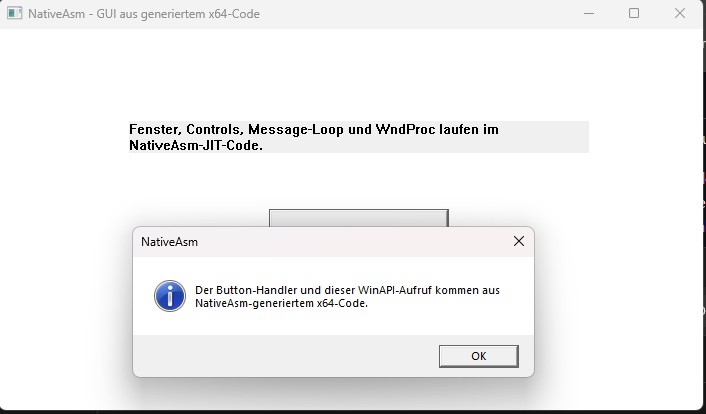
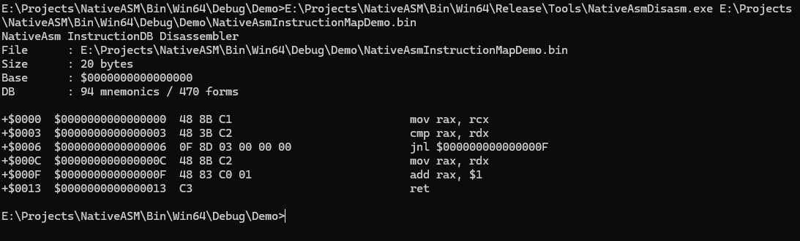
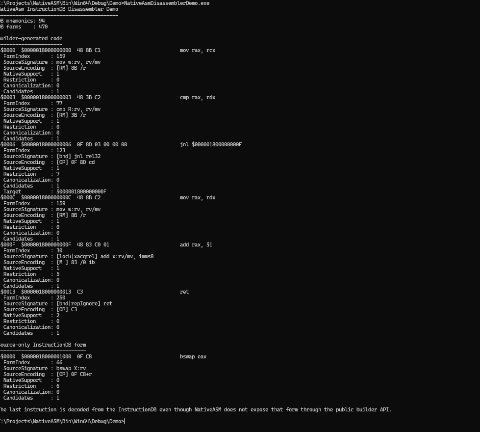
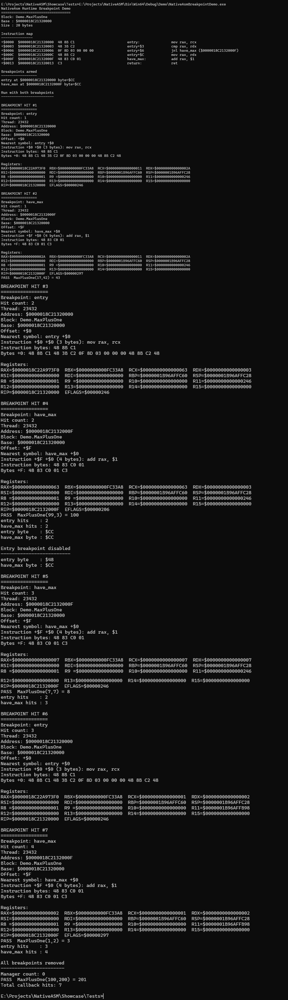

# NativeASM

**Status: Alpha**

NativeASM is a Win64/x86-64 machine-code generation and runtime instrumentation toolkit for Delphi.

The project is intentionally practical in scope. Some parts are deliberately small and direct, while other parts are more structured where the problem benefits from it. NativeASM does not try to model every x86-64 feature, replace a full compiler backend, or hide all low-level details behind a large abstraction layer.

Development is driven by technical interest and available time. There is no guaranteed release schedule, long-term maintenance commitment, or response time for issues and pull requests. APIs, supported instruction subsets, and internal architecture may still change. Contributions, independent research, extensions, and forks are welcome. If active development of this repository slows down or stops, the source will remain available so others can study, adapt, and continue the work independently.

**NOTE** JIT and runtime generated machine code can trigger heuristic or
machine learning based antivirus detections in some environments.

## What it provides

- Fluent x86-64 instruction builder for Delphi.
- Static instruction database with operand validation and deterministic form selection.
- JIT allocation and execution on Win64.
- Labels, fixups, alignment, constant pools, stubs, and Win64 ABI helpers.
- SIMD support covering selected SSE/SSE2/SSSE3/SSE4.x, AES, SHA, PCLMULQDQ, and related instructions.
- CPU feature detection and runtime dispatch helpers.
- Instruction maps and symbol/address resolution for generated code.
- Disassembly backed by NativeASM instruction metadata.
- Runtime software breakpoints with context capture and byte restoration.
- Core regression tests plus higher-level Showcase libraries and benchmarks.

[Benchmark results](BENCHMARKS.md)

NativeASM is currently **Win64 only**. The core source enforces a 64-bit Windows target.

## Small example

```pascal
var
  B: TAsmBuilder;
  R: UInt64;
begin
  B := TAsmBuilder.New;
  try
    B.Mov(RAX, RCX)
     .Add(RAX, RDX)
     .Ret;

    R := B.Run(10, 32);  // R = 42
  finally
    B.Free;
  end;
end;
```

This builds and executes a Win64 function that returns `RCX + RDX`.

## Architecture

```text
Delphi code
    |
    v
TAsmBuilder
    |
    +--> operand and API validation
    |
    v
InstructionDB / SIMD DB
    |
    v
static encoders
    |
    v
machine code + labels/fixups
    |
    v
JIT memory
    |
    v
native x86-64 execution
```

The runtime does not parse the AsmJit JSON database. The JSON data is development-time input for NativeASM's checked-in generated tables.

The current generated core database contains 94 mnemonics, 470 concrete encoding forms, and 850 operand descriptors. The current generated SIMD database contains 275 mnemonics, 338 forms, and 719 operand descriptors. These numbers describe the current NativeASM subset, not the complete x86/x64 ISA; some source forms are intentionally retained as metadata without being exposed through the public Builder API. See [README_STATIC_DB.md](README_STATIC_DB.md) for the database model, generation process, restrictions, and regeneration tools.

## Runtime instrumentation

NativeASM contains more than an encoder. Generated code can be associated with instruction maps and symbols, decoded again, and instrumented with software breakpoints.

Relevant documentation:

- [Instruction maps](NativeASM-InstructionMap.md)
- [Disassembler](NativeASM-Disassembler.md)
- [Runtime breakpoints](NativeASM-Breakpoints.md)

The JIT path uses writable memory while generating code and transitions it to executable protection for execution. Debugger-style runtime patching can temporarily change page protection when a breakpoint byte is installed or restored.

## SIMD and CPU extensions

NativeASM includes a separate SIMD encoding layer and selected CPU-extension support. The project currently demonstrates SSE-family code, CRC32/CRC32C, AES-NI, SHA extensions, POPCNT, and PCLMULQDQ among other covered operations.

See:

- [SIMD support](NativeASM-SIMD.md)
- [AES and bit-count instructions](NativeASM-AES-BitCount.md)
- [SHA instructions](NativeASM-SHA.md)

## Showcase

`Showcase/` contains higher-level code built on NativeASM rather than additional core dependencies. It includes practical algorithms, SIMD paths, cryptographic primitives, BigInt arithmetic, ECC experiments, pattern matching, self-tests, and benchmarks.

Examples currently include CRC, Base64, Hex, Bloom/hash utilities, Aho-Corasick, Levenshtein, ChaCha20, Poly1305, ChaCha20-Poly1305, BLAKE3, Xoshiro256++, multi-precision arithmetic, Montgomery arithmetic, X25519/Ed25519, secp256k1, and P-256 related code.

The Showcase exists primarily to demonstrate what can be expressed, generated, executed, and tested with NativeASM. It is not presented as a collection of audited production cryptography or as the final/optimal implementation of every demonstrated algorithm.

See [Showcase/README.md](Showcase/README.md).

## Building

Open the Delphi project/group files in RAD Studio and build for **Win64**.

A small console demo can also be compiled with `dcc64`, for example from `Demo/`:

```text
dcc64.exe NativeAsmDemo.dpr -B -U..\Source
```

The generated instruction database is checked in. Normal users do not need Python, PowerShell generation scripts, AsmJit, or JSON parsing at runtime.

## Current validation snapshot

The current development snapshot has been exercised locally with the following results:

| Suite | Result |
| --- | ---: |
| Showcase DUnitX | 158 / 158 passed |
| Feature DUnitX | 73 / 73 passed |
| Showcase self-test | 19 / 19 groups passed |
| NativeAsmEncodingTests | 277 passed |
| StaticDbRegression | OK |

Additional demos for breakpoints, instruction maps, disassembly, SHA encodings, and the benchmark projects have also been run successfully during development.

These results describe the currently covered behavior. They are not a claim of complete ISA coverage or formal verification.

## Benchmarks

The repository contains both core and practical benchmark projects. They are intended to measure NativeASM overhead and to demonstrate the performance available from generated CPU-specific code.

Benchmark results are hardware, compiler, build-mode, and workload dependent. Publish numbers together with the system and build configuration used to produce them.

## Repository layout

```text
Source/       NativeASM core
Tests/        core, feature, encoding, and regression tests
Tools/        instruction DB generation and verification tools
Demo/         small core demonstrations
Benchmarks/   core and practical benchmarks
Showcase/     higher-level examples and libraries built on NativeASM
```

See [STRUCTURE.md](STRUCTURE.md) for the dependency split between core and Showcase.

## Alpha scope and non-goals

For the current alpha, assume the following:

- APIs and internal structures can still change.
- Instruction coverage is intentionally incomplete.
- Some valid x86 forms are intentionally not exposed by the public Builder API.
- Some implementations favor a focused, pragmatic solution over maximum generality.
- NativeASM is not a compiler optimizer, register allocator, SSA framework, or LLVM replacement.
- Showcase implementations are demonstrations of the framework and can be simpler or more specialized than a production library would choose to be.

The guiding idea is simple: keep the implementation direct where that is sufficient, and add complexity only where it solves a real problem for the framework.

## Screenshots

NativeASM includes several demos and tools that exercise code generation,
runtime instrumentation, disassembly, instruction mapping, and JIT execution.

### WinGUI demo



### Disassembler




### Runtime breakpoint demo



## AsmJit credit and provenance

NativeASM uses x86 instruction database material and design/test inspiration from [AsmJit](https://github.com/asmjit/asmjit), created and maintained by Petr Kobalicek.

The checked-in `Tools/isa_x86.json` file is an exact copy of AsmJit's `db/isa_x86.json` from commit:

`0bd5787b54b575ed94bf32ac452153b34385c514`

Its SHA-256 is:

`0bc3fde0376e3c7db93ce1fa6da35b9d69b868db738e60dba382a2bee54d1f48`

NativeASM uses this JSON file only as development-time input. NativeASM's generators select and transform supported information into NativeASM-specific generated Pascal tables. AsmJit is not a runtime dependency.

Test ideas, test organization, and selected encoding vectors were also inspired by or adapted from the AsmJit test suite at commit:

`dffd8b164f228abbc47246c9881f107d656952b2`

Reference date: `2026-09-16`.

NativeASM is an independent Delphi project and is not affiliated with or endorsed by AsmJit.

AsmJit is distributed under the zlib License. The original license text is preserved in [Tools/ASMJIT_LICENSE.md](Tools/ASMJIT_LICENSE.md). Detailed database provenance is recorded in [Tools/ASMJIT_SOURCE.md](Tools/ASMJIT_SOURCE.md), and test-specific attribution is recorded in [Tests/ASMJIT_TEST_SOURCE.md](Tests/ASMJIT_TEST_SOURCE.md).

See [THIRD_PARTY_NOTICES.md](THIRD_PARTY_NOTICES.md) for the consolidated third-party notice.

## Project license

MIT license. Provided as is.
The AsmJit-derived material remains subject to AsmJit's zlib License regardless of the license selected for NativeASM's original code.
